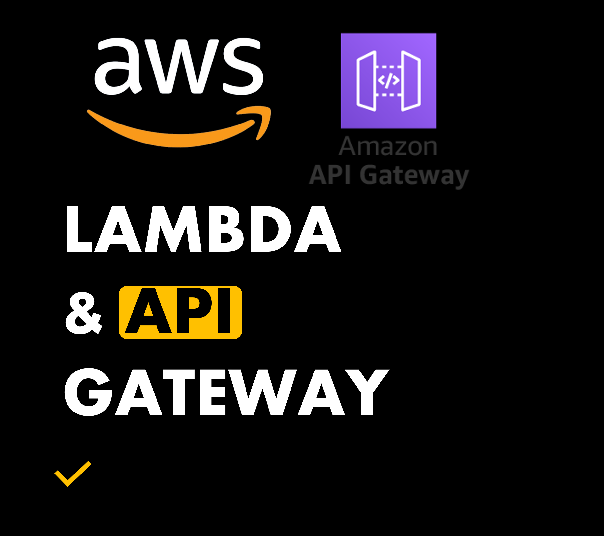
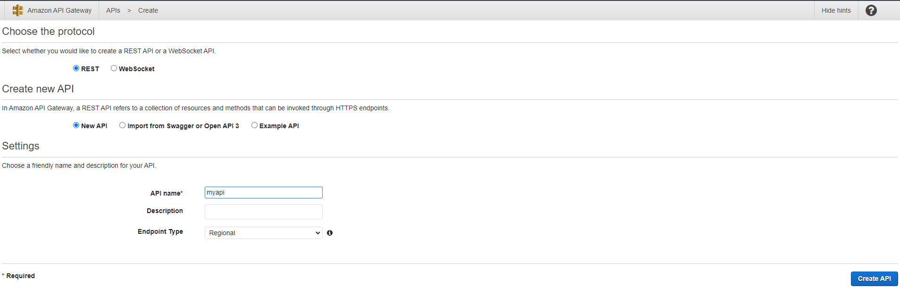
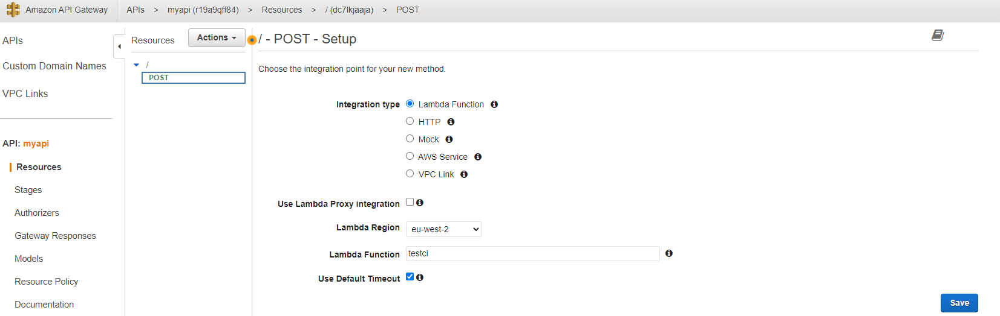
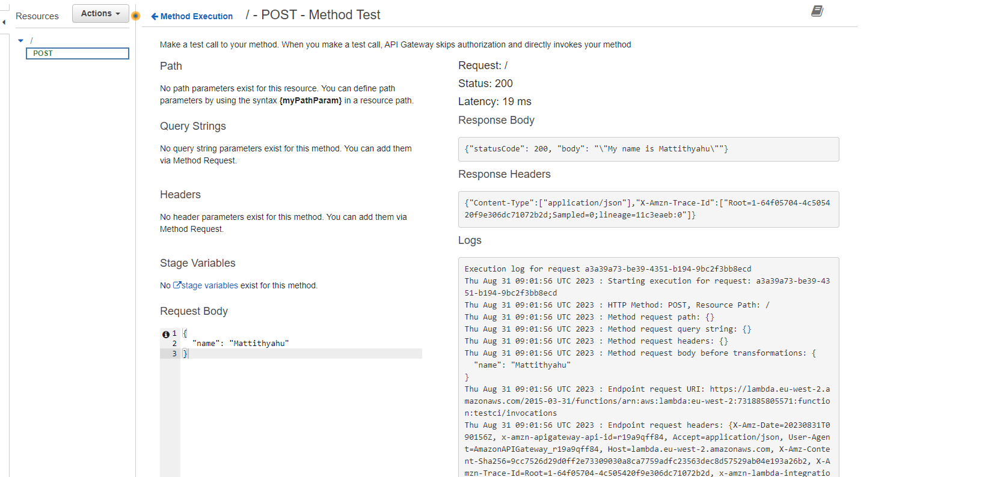
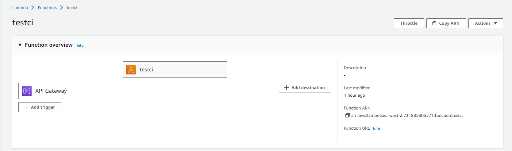
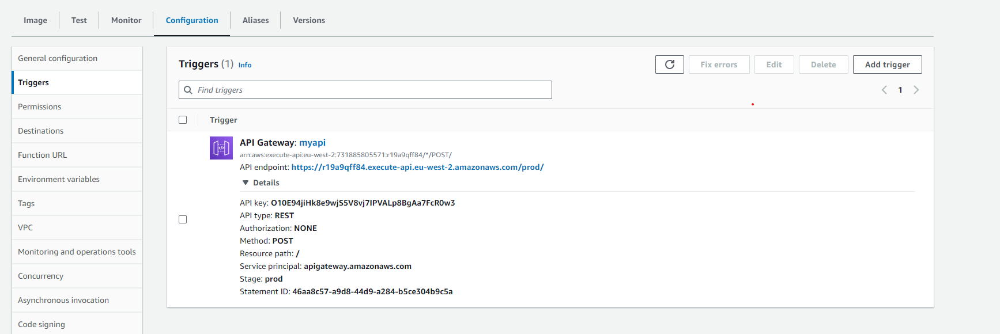
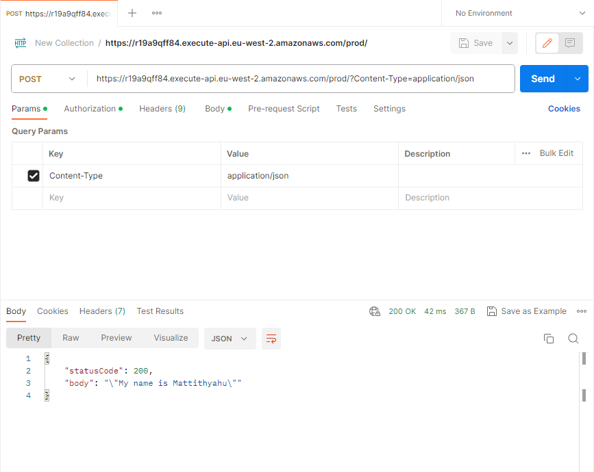
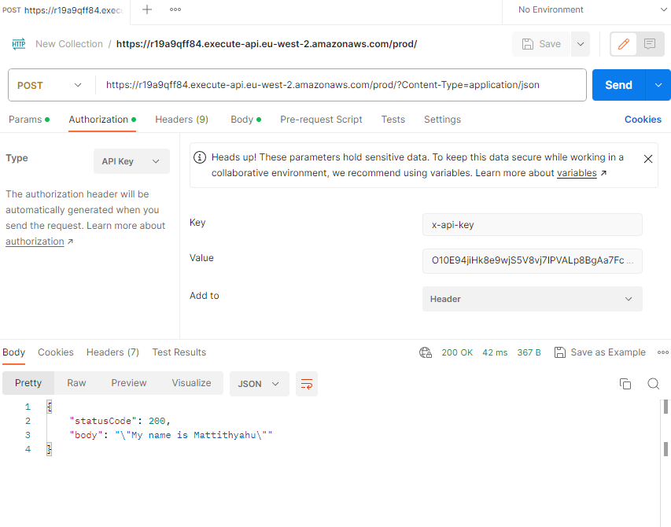
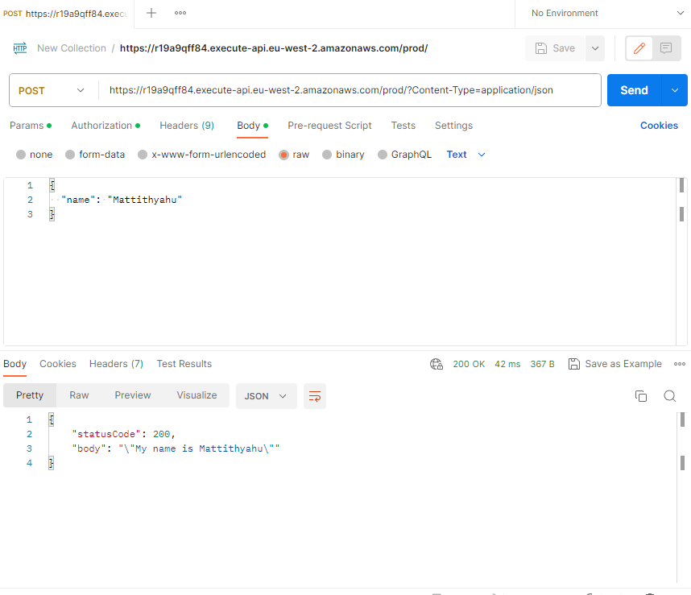
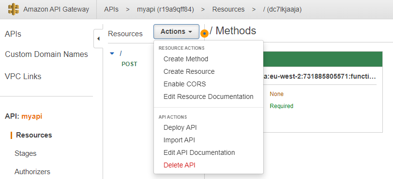

## **AWS API Gateway with Lambda**
Expose Serverless Functions via AWS API Gateway REST APIs

---



You will need:
- AWS

Prerequisite Links:
- [Github](https://github.com/mo-justlearnai/Introduction-to-AWS-Lambda-Serverless-Functions)

Finished Links:
- [Github](https://github.com/mo-justlearnai/AWS-API-Gateway-with-Lambda)

I will be working from a lambda function I built in [this](https://justlearnai.com/introduction-to-aws-lambda-serverless-functions-2ff318cc867c) article.

Ok, Let's get started. 

1. Create a new REST API (not private)
2. The protocol is REST and select New API and name your api
3. After the REST API has been created select actions and create a method
4. Select POST as the method and click on the tick icon to process the method
5. You’ll then be prompted to setup with post method. Select lambda function. DO NOT SELECT LAMBDA PROXY INTEGRATION – THIS PROXY CHANGES THE FORM THR DATA IS TRANSFERRED IN BETWEEN THE REST API AND LAMBDA FUNCTION. We have already configured the correct request and response for the REST API acting as the frontend to communicate perfectly with the lambda function acting as the backend. 
6.  Name the lambda function and leave the Use Default timeout selected. Click save.
7. After the POST method has been saved click on Method Request.
8. Change the API Key Required file dot true and click the tick icon. (We want to secure out api before exposing it *publicly)   (It isn’t necessarily ‘public’ – they are similar to YouTube unlisted videos. You can only view the webpage if you have the link!) – This is a layer of security adding an API key requirement is an added layer of security. 
9. Click Actions and Click Deploy API
10. Create a new stage and name the stage name ‘prod’ or anything else you want. Add a description if you like and then click Deploy. 
11. Great your API has now been deployed so it can now connect to AWS Lambda. We will connect these services next. On the left-hand side towards the bottom of the page select Usage Plans
12. Click create usage plan. Enter a name for the usage plan and a small description. 
Uncheck the throttling and quota checkboxes.
13. Click Add API Stage
14. Select the name of the REST API you created
15. Select the deployment stage you created to deploy the API
16. Ensure you click the tick icon to add the API stage
17. Click Create API Key and add to Usage Plan
18. Name the API key, click auto generate and add a description and click save. 
19. Now the API key has been configured to the REST API. 
20. Navigate back to resources for the API. Click on the POST title in green. 
21. In the Method Execution page click TEST above the lightning bolt
22. Here you can test the API










Now, let's test the REST API in 2 ways. 

Postman and Python

First let's get the API endpoint and API key.




Postman API Testing







After you had added the API endpoint configuration to Postman. Click Send.

Python API Testing

```python

# ==================================================
# Title: API Call testing
# Author: Mattithyahu
# Created Date: 29/08/2023
# ==================================================
# To rest: RUN `python client.py`

# Imports
# ==================================================
import json
import requests

# API Call 
# ==================================================
url = 'https://r19a9qff84.execute-api.eu-west-2.amazonaws.com/prod/'

headers = {'Accept': 'application/json', 
           'x-api-key': 'O10E94jiHk8e9wjS5V8vj7IPVALp8BgAa7FcR0w3'
          }

dicts = {
    'name': 'Mattithyahu'
}

request_data = json.dumps(dicts)

# POST METHOD 
# ==================================================
response = requests.post(url, request_data, headers=headers)

try:
    print("Status Code: " + str(response.status_code))
    print("Message: " + (response.json()['body']))

except Exception as e:
    print(f"Errors : {e} ")
    print("Status Code: " + str(response.status_code))
    print(response.text)

```

Change the API endpoint and API key to your API details.

Run

```shell
python client.py
# Status Code: 200
# Message: "My name is Mattithyahu" 
```

Great, that's how I integrate AWS Lambda and API gateway.

Clean up.

Cleaning up isn't too necessary for the lambda function as (if you exceed the free tier limits) you will only be billed when it is running.

API Gateway on the other hand can cost some money. So, I would shut it down. 

Here's how.

Head to your API and under 'Actions' Click **Delete API**.

Within seconds it should be deleted.




Thanks for reading.

---
<!-- DONE -->
